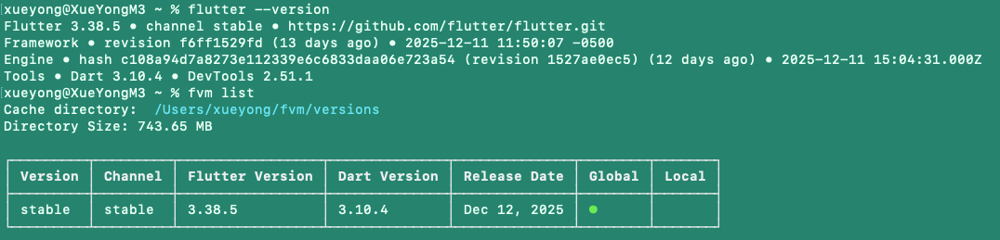

# Flutter 开发环境配置指南 (macOS)

这份文档旨在帮助开发者在 macOS 系统上从零开始搭建 Flutter 开发环境，涵盖 桌面端 (macOS) 和 Web 端的配置。

## 1. 核心依赖安装

### 1.1 安装 Rosetta 2 (仅 Apple Silicon M1/M2/M3 用户)

如果你使用的是 Apple Silicon 芯片的 Mac，需要运行以下命令安装 Rosetta 2 转换器：

```bash
sudo /usr/sbin/softwareupdate --install-rosetta --agree-to-license
```

### 1.2 获取 Flutter SDK (推荐使用 FVM)

作为前端工程师，你一定熟悉 Node.js 的 `nvm`。Flutter 也有类似的工具叫 **FVM (Flutter Version Management)**。它能让你在不同项目间无缝切换 Flutter 版本，避免“升级一个项目，崩了另一个项目”的惨剧。

#### 方案 A: 使用 FVM (强烈推荐)

1. **安装 FVM:**
    使用 Homebrew 安装 (如果你还没有安装 Homebrew，请先访问 brew.sh 安装):

    ```bash
    brew tap leoafarias/fvm && brew install fvm
    ```

2. **安装 Flutter 稳定版:**

    ```bash
    fvm install stable
    ```

3. **设置为全局默认版本:**

    ```bash
    fvm global stable
    ```

4. **配置环境变量:**
    将 FVM 的默认版本路径添加到 Shell 配置中。

    打开配置文件 (`nano ~/.zshrc`)，在末尾添加：

    ```bash
    # FVM 配置
    export PATH="$HOME/fvm/default/bin:$PATH"
    ```

    *注意：如果你之前配置过手动下载的 Flutter PATH，请注释掉或删除它，避免冲突。*

5. **生效并验证:**

    ```bash
    source ~/.zshrc
    flutter --version
    ```

    > **提示:** 第一次运行 `flutter --version` 时，FVM 会自动检测并下载完整的 Dart SDK 及相关二进制文件（可能会看到 `Downloading Dart SDK...` 进度条）。这是正常现象，请耐心等待下载完成。

    *(如果提示 command not found，尝试重启终端)*

    
    

#### 方案 B: 官网手动下载 (传统方式)

如果你不想用工具管理，也可以直接下载。

1. 访问 [Flutter 官网下载页](https://docs.flutter.dev/get-started/install/macos)。
2. 下载最新的 `stable` (稳定版) zip 包。
3. 解压到开发目录（例如 `~/development`）。

    ```bash
    mkdir -p ~/development
    cd ~/development
    unzip ~/Downloads/flutter_macos_*.zip
    ```

4. 配置环境变量 (`~/.zshrc`):

    ```bash
    export PATH="$HOME/development/flutter/bin:$PATH"
    ```

### 1.3 配置环境变量 (已在上述步骤中包含)

*请根据你选择的方案 (A 或 B) 确保 PATH 已正确配置。*

### 1.4 FVM 常用命令与最佳实践 (新增)

在实际开发中，FVM 的核心价值在于**项目级版本隔离**。

* **给项目指定版本:**
    进入项目目录，运行：

    ```bash
    cd my_project
    fvm use stable  # 或者 fvm use 3.19.0
    ```

    这会在项目根目录下生成 `.fvm/` 文件夹。

* **在项目中使用 Flutter 命令:**
    推荐使用 `fvm flutter` 前缀，以确保使用的是项目指定的版本：

    ```bash
    fvm flutter run
    fvm flutter pub get
    ```

    *技巧：你可以在 .zshrc 中配置 alias: `alias f='fvm flutter'`，这样只需输入 `f run`。*

* **查看已安装版本:**

    ```bash
    fvm list
    ```

* **安装特定版本:**

    ```bash
    fvm install 3.16.9
    ```

* **清理未使用版本:**

    ```bash
    fvm remove <version>
    ```

---

## 2. 平台支持配置

### 2.1 macOS 桌面端开发配置

要开发 macOS 桌面应用，必须安装 Xcode。

1. 打开 **App Store**，搜索并安装 **Xcode**。
2. 安装完成后，配置命令行工具：

    ```bash
    sudo xcode-select --switch /Applications/Xcode.app/Contents/Developer
    sudo xcodebuild -runFirstLaunch
    ```

3. 签署 Xcode 许可协议：

    ```bash
    sudo xcodebuild -license
    ```

4. 安装 CocoaPods (用于管理原生依赖)：

    ```bash
    sudo gem install cocoapods
    ```

### 2.2 Web 端开发配置

Flutter Web 依赖 Chrome 浏览器进行调试。

1. 确保已安装 **Google Chrome**。
2. 验证 Web 支持是否开启（通常默认开启）：

    ```bash
    flutter config --enable-web
    ```

### 2.3 启用桌面端支持

如果你使用的是旧版本 Flutter，可能需要手动开启桌面支持：

```bash
flutter config --enable-macos-desktop
```

---

## 3. IDE 开发工具配置 (VS Code)

作为前端工程师，强烈推荐使用 VS Code。

1. 打开 VS Code。
2. 点击左侧扩展图标 (Extensions)。
3. 搜索并安装以下插件：
    * **Flutter** (会自动安装 Dart 插件)
    * **Dart**
    * **Flutter Intl** (可选，用于多语言国际化)
    * **Pubspec Assist** (可选，方便管理依赖)

### 3.1 配合 FVM 使用 VS Code

如果你使用了 FVM，VS Code 可能无法自动找到 Flutter SDK。

1. 打开 VS Code 设置 (Cmd + ,)。
2. 搜索 `dart.flutterSdkPaths`。
3. 添加一项：`/Users/你的用户名/fvm/versions` (或者直接指向 `~/fvm/default`)。
    * *小技巧：在项目根目录下运行 `fvm use stable` 会生成 `.fvm` 配置文件夹，VS Code 通常能自动识别。*

---

## 4. 环境自检

运行 `flutter doctor` 命令来检查是否有遗漏的配置。

```bash
flutter doctor
```

**常见输出说明：**

* ✅ **Flutter:** 核心 SDK 已就位。
* ✅ **Chrome - develop for the web:** Web 开发就绪。
* ✅ **Xcode - develop for iOS and macOS:** macOS/iOS 开发就绪。
* ✅ **VS Code:** IDE 插件已就绪。
* ⚠️ **Android toolchain:** 如果你不开发 Android App，可以忽略此项警告。
