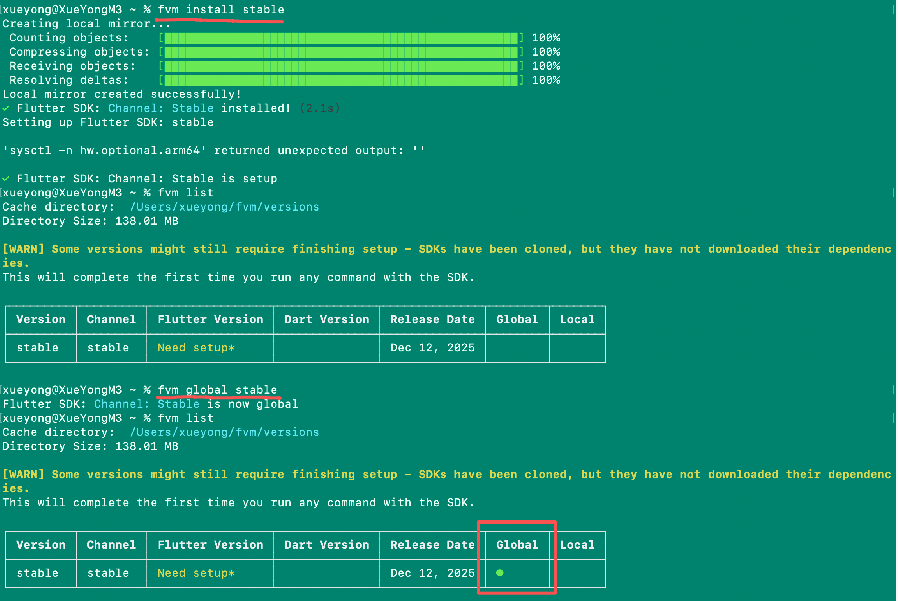

# Flutter 开发环境配置指南 (macOS)

这份文档旨在帮助开发者在 macOS 系统上从零开始搭建 Flutter 开发环境，涵盖桌面端 (macOS) 和 Web 端的配置。

## 0. 开始前你需要知道

- 如果你打算使用 FVM，建议全程优先用 `fvm flutter ...`（尤其是项目里），避免误用系统 Flutter。
- 完成本文档后，最终以 `flutter doctor`（或 `fvm flutter doctor`）全绿为准。
- 若你在国内网络环境，遇到依赖下载卡住，可直接跳到「常见问题」查看镜像设置。

## 1. 核心依赖安装

### 1.1 安装 Rosetta 2 (仅 Apple Silicon M1/M2/M3 用户)

如果你使用的是 Apple Silicon 芯片的 Mac，需要运行以下命令安装 Rosetta 2 转换器：

```bash
sudo /usr/sbin/softwareupdate --install-rosetta --agree-to-license
```

### 1.2 获取 Flutter SDK (推荐使用 FVM)

作为前端工程师，你一定熟悉 Node.js 的 `nvm`。Flutter 也有一套版本管理工具：**FVM (Flutter Version Management)**。它能让你在不同项目间无缝切换 Flutter 版本，避免“升级一个项目，崩了另一个项目”的惨剧。

#### 方案 A: 使用 FVM (强烈推荐)

1. **安装 FVM:**
    使用 Homebrew 安装 (如果你还没有安装 Homebrew，请先访问 brew.sh 安装):

    ```bash
    brew tap leoafarias/fvm && brew install fvm
    ```

2. **安装 Flutter 稳定版:**

    ```bash
    fvm install stable
    ```

3. **设置为全局默认版本:**

    ```bash
    fvm global stable
    ```

4. **配置环境变量:**
    将 FVM 的默认版本路径添加到 Shell 配置中。

    打开配置文件 (`nano ~/.zshrc`)，在末尾添加：

    ```bash
    # FVM 配置
    export PATH="$HOME/fvm/default/bin:$PATH"
    ```

    *注意：如果你之前配置过手动下载的 Flutter PATH，请注释掉或删除它，避免冲突。*

5. **生效并验证:**

    ```bash
    source ~/.zshrc
    flutter --version
    ```

    > **提示:** 第一次运行 `flutter --version` 时，FVM 会自动检测并下载完整的 Dart SDK 及相关二进制文件（可能会看到 `Downloading Dart SDK...` 进度条）。这是正常现象，请耐心等待下载完成。

    *(如果提示 command not found，尝试重启终端)*

    
    

6. **确认正在使用哪一个 Flutter:**

    ```bash
    which flutter
    flutter --version
    ```

    *如果 `which flutter` 不是指向 `~/fvm/default/bin/flutter`，说明 PATH 还没生效或存在冲突。*

#### 方案 B: 官网手动下载 (传统方式)

如果你不想用工具管理，也可以直接下载。

1. 访问 [Flutter 官网下载页](https://docs.flutter.dev/get-started/install/macos)。
2. 下载最新的 `stable` (稳定版) zip 包。
3. 解压到开发目录（例如 `~/development`）。

    ```bash
    mkdir -p ~/development
    cd ~/development
    unzip ~/Downloads/flutter_macos_*.zip
    ```

4. 配置环境变量 (`~/.zshrc`):

    ```bash
    export PATH="$HOME/development/flutter/bin:$PATH"
    ```

### 1.3 配置环境变量 (已在上述步骤中包含)

*请根据你选择的方案 (A 或 B) 确保 PATH 已正确配置。*

### 1.4 FVM 常用命令与最佳实践 (新增)

在实际开发中，FVM 的核心价值在于**项目级版本隔离**。

- **给项目指定版本:**
    进入项目目录，运行：

    ```bash
    cd my_project
    fvm use stable  # 或者 fvm use 3.19.0
    ```

    这会在项目根目录下生成 `.fvm/` 文件夹。

- **在项目中使用 Flutter 命令:**
    推荐使用 `fvm flutter` 前缀，以确保使用的是项目指定的版本：

    ```bash
    fvm flutter run
    fvm flutter pub get
    ```

    *技巧：你可以在 .zshrc 中配置 alias: `alias f='fvm flutter'`，这样只需输入 `f run`。*

- **查看已安装版本:**

    ```bash
    fvm list
    ```

- **安装特定版本:**

    ```bash
    fvm install 3.16.9
    ```

- **清理未使用版本:**

    ```bash
    fvm remove <version>
    ```

---

## 2. 平台支持配置

### 2.1 macOS 桌面端开发配置

要开发 macOS 桌面应用，必须安装 Xcode。

1. 打开 **App Store**，搜索并安装 **Xcode**。
2. 安装完成后，配置命令行工具：

    ```bash
    sudo xcode-select --switch /Applications/Xcode.app/Contents/Developer
    sudo xcodebuild -runFirstLaunch
    ```

3. 签署 Xcode 许可协议：

    ```bash
    sudo xcodebuild -license
    ```

4. 安装 CocoaPods (用于管理原生依赖)：

    ```bash
    sudo gem install cocoapods
    ```

> 提示：如果你只做 Flutter Web，可以先跳过 Xcode / CocoaPods；但做 iOS/macOS 原生依赖（`pod install`）时必须安装。

### 2.2 Web 端开发配置

Flutter Web 依赖 Chrome 浏览器进行调试。

1. 确保已安装 **Google Chrome**。
2. 验证 Web 支持是否开启（通常默认开启）：

    ```bash
    flutter config --enable-web
    ```

> 画板/高频绘制场景建议优先用 CanvasKit 渲染器进行调试（更接近“画布”表现与性能预期）：
>
> - `flutter run -d chrome --web-renderer canvaskit`

### 2.3 启用桌面端支持

如果你使用的是旧版本 Flutter，可能需要手动开启桌面支持：

```bash
flutter config --enable-macos-desktop
```

---

## 3. IDE 开发工具配置 (VS Code)

作为前端工程师，强烈推荐使用 VS Code。

1. 打开 VS Code。
2. 点击左侧扩展图标 (Extensions)。
3. 搜索并安装以下插件：
    - **Flutter** (会自动安装 Dart 插件)
    - **Dart**
    - **Flutter Intl** (可选，用于多语言国际化)
    - **Pubspec Assist** (可选，方便管理依赖)

### 3.1 配合 FVM 使用 VS Code

如果你使用了 FVM，VS Code 可能无法自动找到 Flutter SDK。

1. 打开 VS Code 设置 (Cmd + ,)。
2. 搜索 `dart.flutterSdkPaths`。
3. 添加一项：`/Users/你的用户名/fvm/versions` (或者直接指向 `~/fvm/default`)。
    - *小技巧：在项目根目录下运行 `fvm use stable` 会生成 `.fvm` 配置文件夹，VS Code 通常能自动识别。*

---

## 4. 环境自检

运行 `flutter doctor` 命令来检查是否有遗漏的配置。

```bash
flutter doctor
```

> 如果你没有做 `fvm global stable`，或你希望在某个项目里检查项目绑定的版本，请用：`fvm flutter doctor -v`

**常见输出说明：**

- ✅ **Flutter:** 核心 SDK 已就位。
- ✅ **Android toolchain:** Android 开发环境已就绪（如果此处有 ⚠️ 警告且你不开发 Android App，可忽略）。
- ✅ **Xcode:** iOS/macOS 开发环境已就绪。
- ✅ **Chrome:** Web 开发环境已就绪。
- ✅ **Network resources:** 网络连接正常。

**理想状态:**
如果所有项都是绿色 ✅，并显示 `No issues found!`，说明你的环境完美无缺。


---

## 5. 项目级运行与调试（va-edu）

在本项目里建议统一使用 FVM：

```bash
fvm flutter pub get
fvm flutter pub run build_runner build --delete-conflicting-outputs
```

运行：

```bash
fvm flutter run -d chrome
fvm flutter run -d macos
```

黑板场景在 Web 端调试时，可以在 `run` 阶段指定渲染器：

```bash
fvm flutter run -d chrome --web-renderer canvaskit
```

> 说明：`--web-renderer` 是 `flutter run` 的参数；`flutter build web` 不提供该参数。

---

### 5.1 VS Code 调试与 Flutter DevTools

1. 选择设备（右下角）：`macos` 或 `chrome`
2. 运行：
   - `Start Debugging`（调试运行）
   - 或 `Run Without Debugging`（不挂调试器）
3. 打开 DevTools：
   - VS Code 命令面板：`Dart: Open DevTools`
   - 或在 Debug 工具栏点击 `Open DevTools`

> 本仓库已提供 VS Code 启动配置：`.vscode/launch.json`

### 5.2 终端调试与 Flutter DevTools

用终端启动（保持进程在前台）：

```bash
fvm flutter run -d macos
```

或：

```bash
fvm flutter run -d chrome
```

启动后终端会输出 DevTools 链接（包含 `?uri=` 参数），直接打开即可使用 Inspector/Performance/Network 等功能。

---

## 6. Flutter 常用命令速查

建议在本机与项目里统一使用 FVM（下文用 `fvm flutter` 举例；如果你不使用 FVM，把它替换成 `flutter` 即可）。

### 6.1 依赖管理（装包/更新/检查）

- 安装依赖（按 `pubspec.yaml`）：`fvm flutter pub get`
- 添加依赖：`fvm flutter pub add <package>`
- 移除依赖：`fvm flutter pub remove <package>`
- 升级依赖（按约束）：`fvm flutter pub upgrade`
- 查看可升级依赖：`fvm flutter pub outdated`

### 6.2 运行与设备

- 环境检查：`fvm flutter doctor -v`
- 查看可用设备：`fvm flutter devices`
- 运行到 Web：`fvm flutter run -d chrome`
- 运行到 macOS：`fvm flutter run -d macos`
- Web 指定渲染器（画板场景建议 CanvasKit 调试）：`fvm flutter run -d chrome --web-renderer canvaskit`

### 6.3 构建与打包

- 构建 Web：`fvm flutter build web`
- 构建 macOS（Debug）：`fvm flutter build macos --debug`
- 构建 macOS（Release）：`fvm flutter build macos --release`

> 你当前项目主要目标是 Web + macOS；如果后续扩展到移动端，再补 `build ios`、`build apk/appbundle` 等命令即可。

### 6.4 质量检查与测试

- 静态分析：`fvm flutter analyze`
- 运行测试：`fvm flutter test`

### 6.5 代码生成（Riverpod / Freezed / JsonSerializable）

- 生成一次：`fvm flutter pub run build_runner build --delete-conflicting-outputs`
- 持续监听：`fvm flutter pub run build_runner watch --delete-conflicting-outputs`

### 6.6 Hooks（可选）

如果你希望减少 `StatefulWidget + initState/dispose` 的样板代码，可以使用 hooks：

- 依赖：`flutter_hooks`（基础 hooks）+ `hooks_riverpod`（与 Riverpod 组合）
- 常用场景：`TextEditingController`、`AnimationController`、订阅/监听、页面级局部状态

### 6.7 常用排错

- 清理构建缓存：`fvm flutter clean`（之后通常需要再跑 `fvm flutter pub get`）
- 查看 Flutter/Dart 版本：`fvm flutter --version`

---

## 7. 常见问题 (Troubleshooting)

### 7.1 `zsh: command not found: flutter`

- 确认 `~/.zshrc` 里已加入 PATH，并执行 `source ~/.zshrc`
- 用 `which flutter` 看看命令实际指向哪里

### 7.2 `Network resources` 失败 / `pub get` 很慢（可选）

如果你遇到 Flutter/Dart 相关下载很慢或失败，可临时设置国内镜像（仅对当前终端会话生效）：

```bash
export PUB_HOSTED_URL=https://pub.flutter-io.cn
export FLUTTER_STORAGE_BASE_URL=https://storage.flutter-io.cn
```

然后重试：

```bash
flutter doctor
flutter pub get
```

### 7.3 CocoaPods 相关报错

- `CocoaPods not installed`: `sudo gem install cocoapods`
- Xcode 许可/首次运行未完成：`sudo xcodebuild -runFirstLaunch`、`sudo xcodebuild -license`
